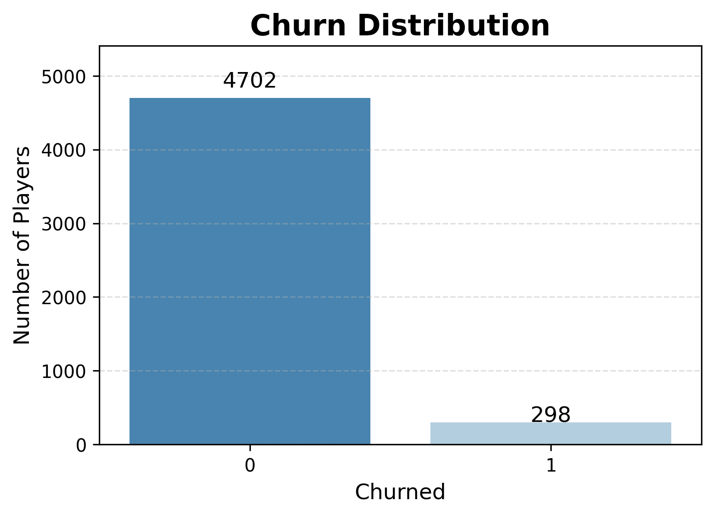
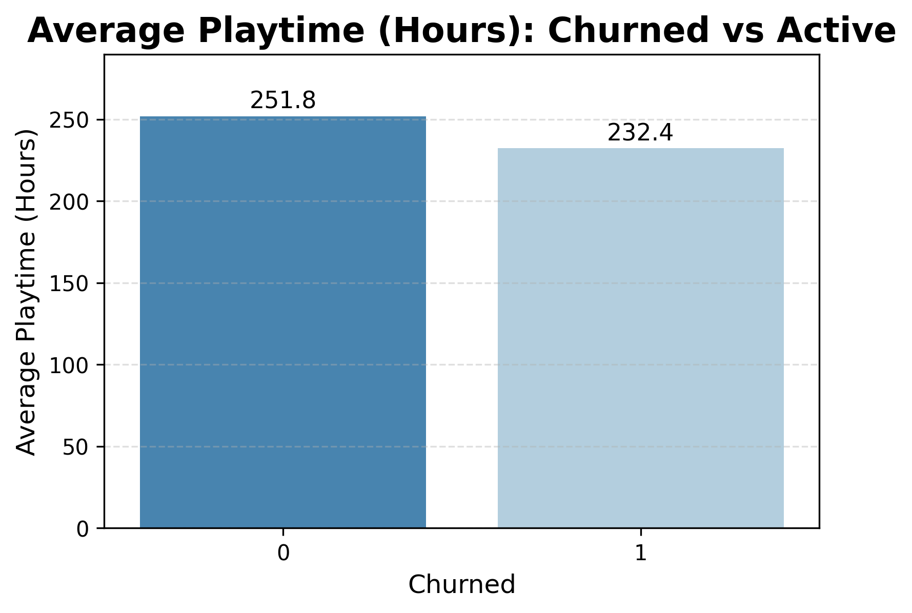
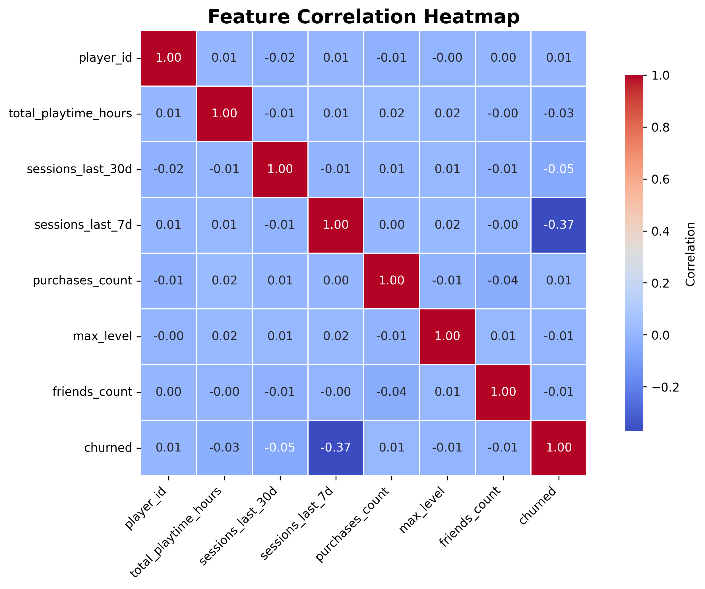
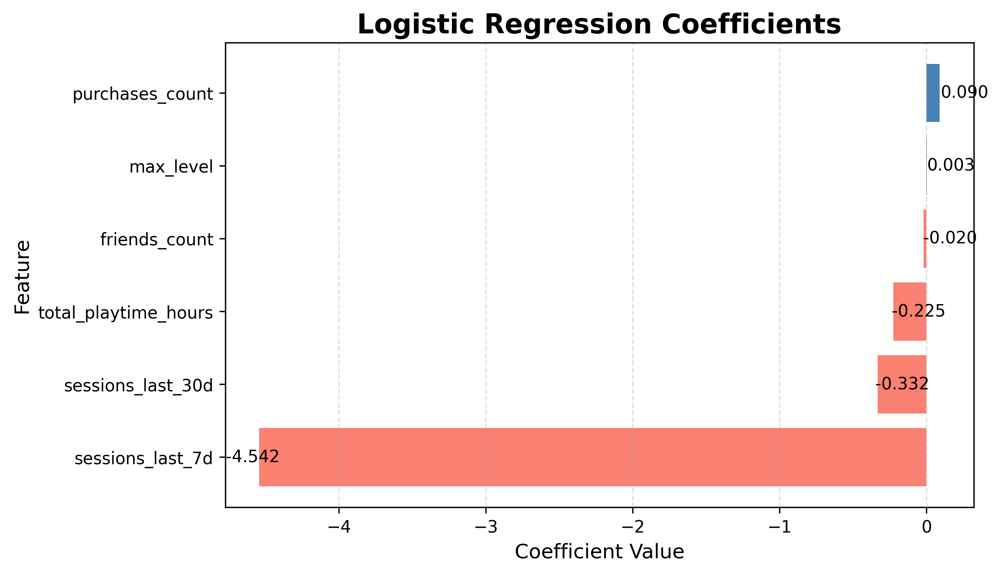
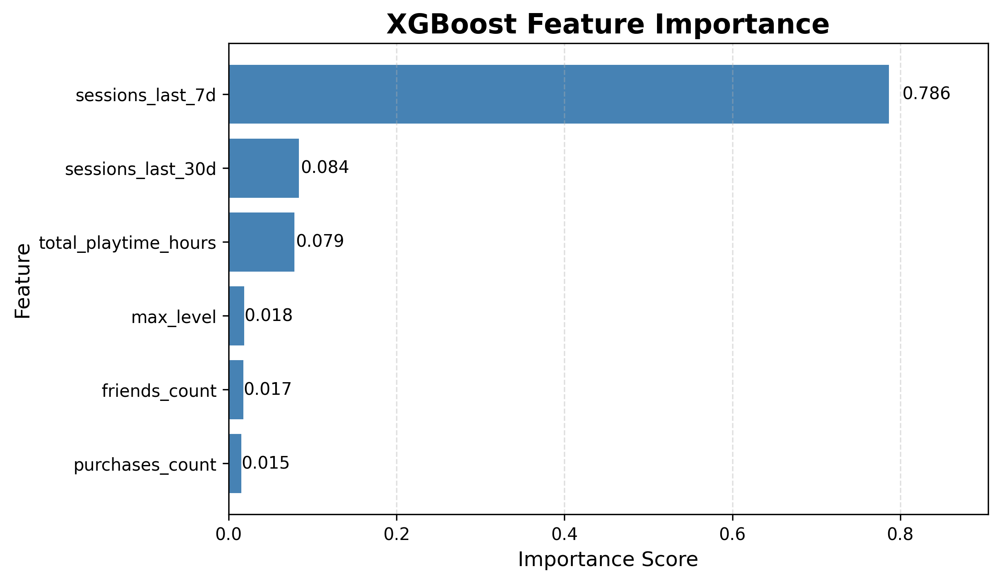

# Player Churn Prediction & A/B Testing - Game Analytics Project With Synthetic Data

This project explores how players engage with a game and uses machine learning to predict which players are likely to churn. Along the way, it examines key behavioral signals, builds churn models, and runs a small A/B test to measure whether a retention reward could keep players active. It includes data creation, analysis, modeling, and experiment evaluation.

## Key components:

- **Synthetic dataset generation** (5,000 players)
- **Exploratory Data Analysis (EDA)**
- **Churn prediction models:**
  - Logistic Regression
  - Random Forest
  - XGBoost
- **Feature importance analysis**
- **A/B test simulation and hypothesis testing**
- **Data-driven recommendations**

## Dataset Description

Each row represents a player with the following gameplay activity metrics:

| Feature | Description |
|--------|-------------|
| `total_playtime_hours` | Total hours played |
| `sessions_last_30d` | Sessions in last 30 days |
| `sessions_last_7d` | Sessions in last 7 days |
| `purchases_count` | Number of in-game purchases |
| `max_level` | Highest level reached |
| `friends_count` | Number of in-game friends |
| `churned` | 1 = churned, 0 = active |

Dataset is generated via `scripts/generate_data.py`.

## Exploratory Data Analysis (EDA)

Analysis includes:

- Churn distribution
- Summary statistics
- Correlation matrix
- Visual comparison of churned vs active players
- Insights into how engagement metrics relate to retention

  ### Key EDA Visuals

| Churn Distribution | Churned vs Active – Avg Playtime |
|-------------------|-----------------------------------|
|  |  |

| Feature Correlation Heatmap |
|-----------------------------|
|  |

Notebook: `notebooks/eda.ipynb`

## Machine Learning Modeling

### Models Trained

| Model | Accuracy | F1 (churn) | ROC-AUC | Notes | Visualization |
|-------|----------|------------|---------|--------|----------------|
| Logistic Regression | 0.968 | 0.64 | 0.94 | Strong baseline performance |  |
| Random Forest | 1.00 | 1.00 | 1.00 | Achieved perfect scores due to deterministic churn patterns |  |
| XGBoost | 1.00 | 1.00 | 1.00 | Similar perfect scores with boosted trees |  |

### Key Insights

- **Recent sessions** (`sessions_last_7d`, `sessions_last_30d`) were the top predictors of churn
- Gameplay engagement metrics clearly separate churners from active players
- Linear models provide realistic performance; tree models learn deterministic rules in the synthetic dataset

Notebook: `notebooks/model.ipynb`

## A/B Test – Retention Experiment

A randomized experiment was simulated on **2,000 at-risk players**:

- **Group A (Control)**: no reward  
- **Group B (Treatment)**: retention reward (XP/coins)

### A/B Results

| Group | Retention Rate |
|-------|----------------|
| A (Control) | **31.49%** |
| B (Treatment) | **37.15%** |

- **Lift:** +5.69 percentage points
- **Z-stat:** 2.684
- **p-value:** 0.00727
- **Conclusion:** statistically significant improvement

Notebook: `notebooks/ab_test.ipynb`

## Tools & Packages Used

**Core Tools**
- Python  
- Jupyter Notebook  

**Data Processing**
- Pandas  
- Numpy  

**Machine Learning**
- Scikit-learn  
- XGBoost  

**Visualization**
- Matplotlib  
- Seaborn  

**Statistics**
- Scipy
